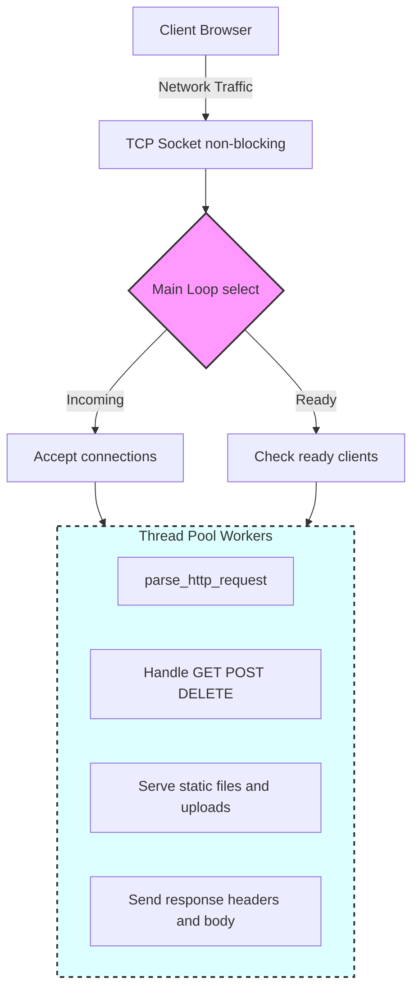

# Non-Blocking Multi-Client HTTP Web Server

A lightweight, non-blocking HTTP server implemented in C. Supports `GET`, `HEAD`, `POST` (including multipart/form-data file uploads), and `DELETE` methods. Designed for concurrency using a thread pool and non-blocking sockets.

---

## Features

- Non-blocking I/O on sockets
- Handles multiple simultaneous client connections
- Parses HTTP requests with headers, cookies, and query parameters
- Serves static files efficiently with `sendfile`
- Supports file uploads via `POST` multipart/form-data
- Handles common HTTP response codes (`400`, `404`, `500`)
- Logs requests to `stderr`
- Persistent connections with `keep-alive`

## Architecture Overview



---

## Getting Started

### Build

```bash
gcc -o server main.c http.c router.c threadpool.c -lpthread
```

### Run

```bash
./server
```

### Visit
Open your browser and go to: 

`
http://localhost:8080
`

---

## Example Request Flow

1. Browser sends HTTP request.
2. Server accepts connection on non-blocking socket.
3. `select()` identifies ready sockets.
4. Connection is pushed to a thread pool worker.
5. Worker thread calls `parse_http_request()`:

   * Parses method, path, and version
   * Parses headers and cookies
   * Parses query parameters
   * Reads body if present (including multipart uploads)
6. Worker handles request:

   * Serves static files (`GET`/`HEAD`)
   * Handles file uploads (`POST`)
   * Deletes files (`DELETE`)
   * Responds with appropriate HTTP status code
7. Response sent back using `write_all()`
8. Connection closes or persists (if keep-alive)

---

## File Upload Example

* POST a file via an HTML form.
* Uploaded files are saved in the `www/uploads/` directory.

---

## License

MIT License